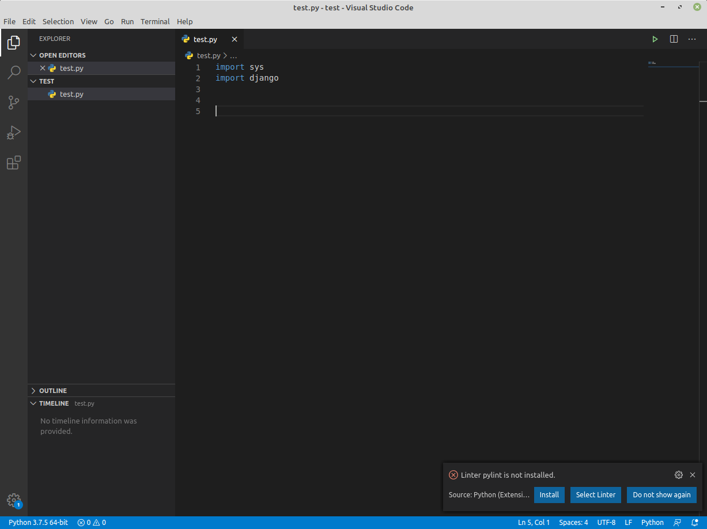
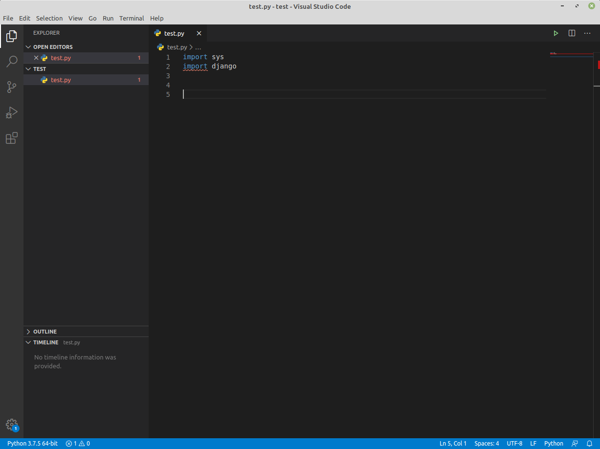
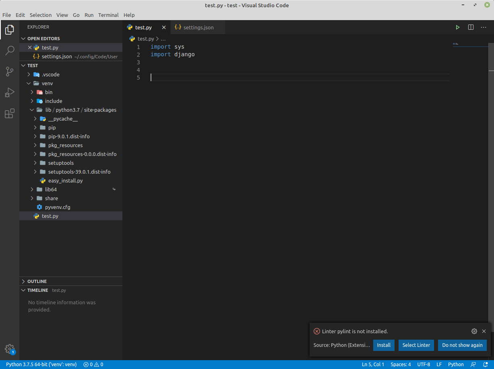
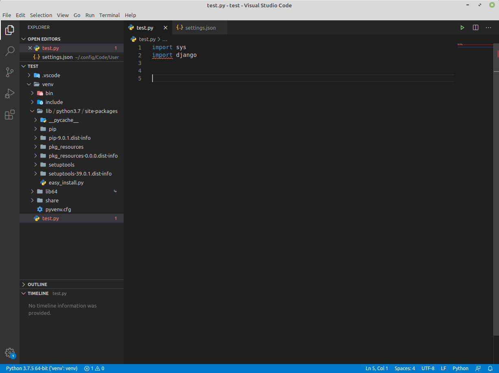
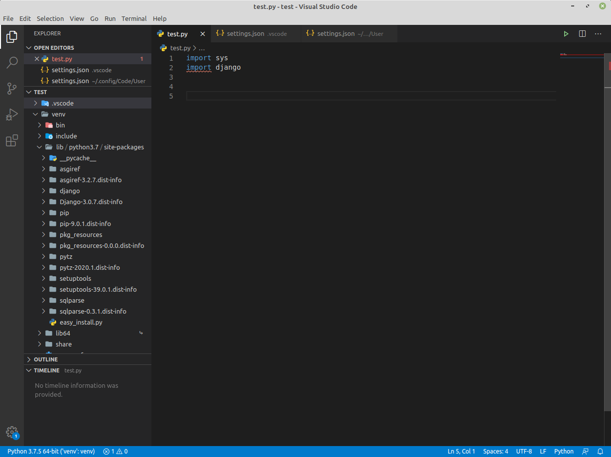
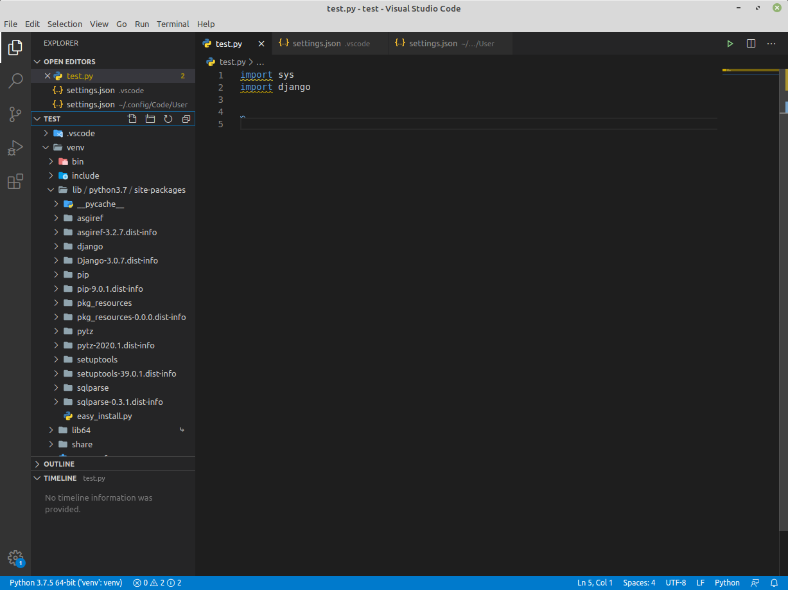
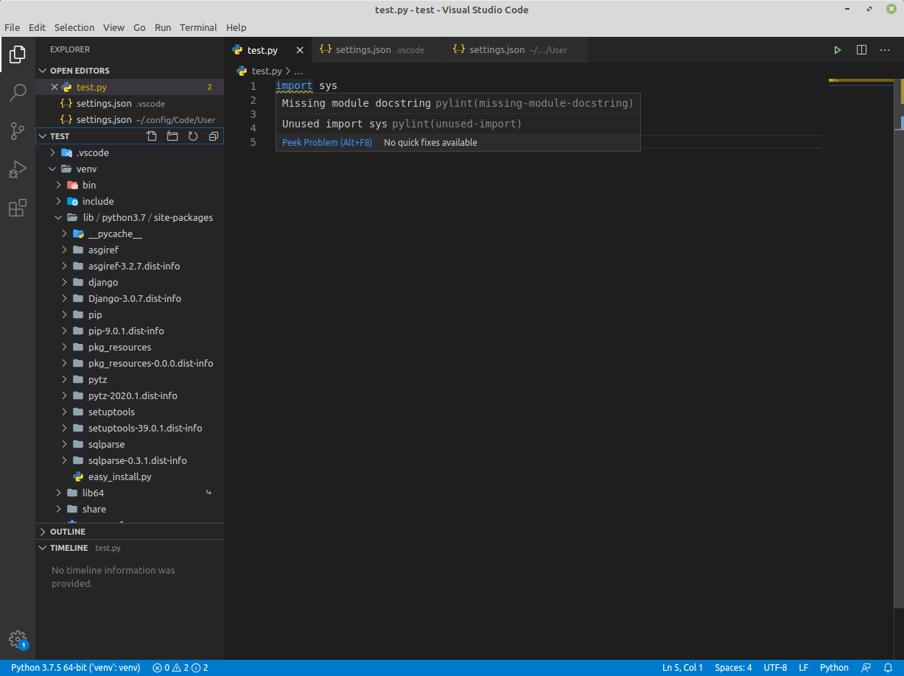
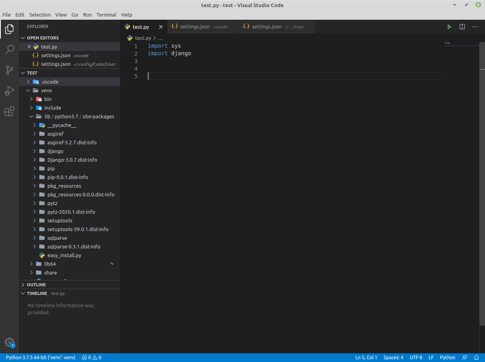

# Linting in VSCode With Virtual Environments

## TLDR
Python virtual envirnments should only contain the modules needed to run your code. They should not contain any modules required to write the code, such as linting modules.
### Quck Steps
1. add **pylint**'s path to your global **settings.json** file
```json
"python.linting.pylintPath": "~/.local/bin/pylint"
```
2. add the following **pylintArgs** to your workspace's **setting.json** file
```json
"python.linting.pylintArgs": [
  "--disable=all",
  "--enable=F,E,unreachable,duplicate-key,unnecessary-semicolon,global-variable-not-assigned,unused-variable,binary-op-exception,bad-format-string,anomalous-backslash-in-string,bad-open-mode",
  "--init-hook",
  "import sys; sys.path.append('venv/lib/python3.7/site-packages')"
    ]
```

## Why This Writeup?
VSCode utilizes python modules to lint python files. In this writeup, I'm using the **pylint** package. If you don't already have **pylint** installed along with it's dependences VSCode will provide a popup asking you to install one as soon as you open a python file. I don't have **django** installed globally. Notice the `import django` statement isn't complaining. That's because the linting package isn't installed. Let's take care of that.
<br>

The install add's the following modules to your global envirnment:
**astroid**, **isort**, **lazy**, **mccabe**, **pylint**, **six**, **toml**, **typed**, **wrapt**
Now that pylint is installed, the linting starts to work and VSCode is complaining about **django** missing

<br>
You are now set up for python linting as long as you contiue using your global python envirnment. However, once you switch your workspace over to a virtual envirnment (venv) things get a little tricky.  <br>
Notice how VSCode is no longer complaining about **django** even though it's not installed. When you start a new a venv, you no longer have access the your global's **pylint** package. By default, VSCode will again ask if you'd like to install **pylint** and it's dependencies. 
<br>

Python virtual envirnments should only contain the modules needed to run your code. They should not contain any modules required to write the code, such as linting modules. This is so when you ship off your code you can do a simple `pip freeze` and it's output is __only__ the required modules.

### So how do you Lint Python in VSCode Without Installing Linting Modules in your VENV?
First, you need to add **pylint**'s path (from your global install) to VSCode's global **setting.json**.
```json
"python.linting.pylintPath": "~/.local/bin/pylint"
```
This will force VSCode to use your global pylint libraries. Now VSCode is again complaining about **django** not being installed. Which it should.
<br>
Even after installing **django** VSCode is still complaining. What's going on here?
<br>
The pylint file from `~/.local/bin/` is an executable which VSCode calls. And that executable utlizes your global python envirnment when executed. In my case `/usr/bin/python3.7`. And since my global environment doesn't have django, **pylint** tells VSCode to complain.<br> So how to we let **pylint** know about the venv's installed modules? Well it turns out it'll take a `--init-hook` option where you can add your venv's path to `sys.path` so that it can become aware of the packages. You do this by adding the following to your workspace's **settings.json**
```json
"python.linting.pylintArgs": [
  "--init-hook",
  "import sys; sys.path.append('venv/lib/python3.7/site-packages')"
    ]
```
It looks like we made things worse! Now VSCode is even complaining about **sys** not existing.
<br>

Things look like they got worse because **pylint** is no longer outputing a response VSCode expects and thus causing the weird linting. After some research, I found that invoking the pylintArgs wipes out other arguments VSCode normally passes **pylint** which is needed to get back the exact reponse it's coded for. You can find more information [here](https://code.visualstudio.com/docs/python/linting#_default-pylint-rules). We can add these back in to get things working again.

```json
"python.linting.pylintArgs": [
  "--disable=all",
  "--enable=F,E,unreachable,duplicate-key,unnecessary-semicolon,global-variable-not-assigned,unused-variable,binary-op-exception,bad-format-string,anomalous-backslash-in-string,bad-open-mode",
  "--init-hook",
  "import sys; sys.path.append('venv/lib/python3.7/site-packages')"
    ]
```
Finally, we get exactly what we were looking for. We have global linting in a venv without mudding up our venv's installed modules



Virtual Environment Packages